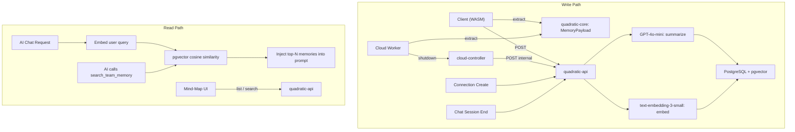

# AI Memory System

## Overview

The AI Memory System is a team-scoped knowledge base that automatically generates, stores, and retrieves summaries of files, code cells, connections, and chat insights. It makes the AI assistant smarter the more you use it, and shares that knowledge across all team members.

Every time a user runs code, connects to a database, or has a meaningful AI conversation, the system extracts key information, summarizes it with an LLM, and stores it as a searchable memory. When any team member later asks the AI a question, relevant memories are automatically retrieved and included in context.

## Architecture

The system has two main paths: a **write path** that creates memories, and a **read path** that retrieves them during AI conversations.



### Design Principles

- **Content extraction lives in Rust (`quadratic-core`)** so the same code works from both the browser (WASM) and cloud workers (native). No duplication of extraction logic.
- **Summarization and storage live in `quadratic-api`** (TypeScript/Node.js) where the LLM providers and database are already integrated.
- **No changes to `quadratic-files` or `quadratic-multiplayer`**. Memory generation is triggered by the entities that see the results first: the client (after code execution) and the cloud worker (after scheduled tasks).
- **The cloud worker communicates through the cloud controller**, not directly to the API. The controller forwards the memory payload to the API via an internal endpoint.

## Data Flow

### Client-Triggered Memories (Primary Path)

1. User runs a Python/JS/Formula code cell in the browser
2. `updateCodeCells` event fires on the client
3. After a 5-second debounce (and a 1-minute per-file cooldown), the client calls `quadraticCore.getMemoryPayload()`
4. The WASM binding calls `GridController::extract_memory_payload()` in Rust, which walks all sheets and data tables to build a `MemoryPayload`
5. The client POSTs the payload to `POST /v0/teams/:uuid/ai/memories/generate` on `quadratic-api`
6. The API handler fires and returns `202 Accepted` immediately
7. In the background, the API:
   - Calls GPT-4o-mini to generate a file-level summary
   - Calls GPT-4o-mini for each non-errored code cell summary
   - Generates embeddings via `text-embedding-3-small` for each summary
   - Upserts into the `ai_memory` table (deduplication via unique constraint on `team_id + file_id + entity_type + entity_id`)

### Cloud Worker Memories (Scheduled Tasks)

1. Cloud worker finishes executing scheduled task operations
2. During shutdown, the worker calls `self.core.extract_memory_payload()` to serialize the grid state
3. The `memory_payload` JSON is included in the `ShutdownRequest` sent to the cloud controller
4. The controller forwards it to `POST /v0/internal/file/:uuid/ai-memory` on `quadratic-api`
5. The API processes it identically to the client path

### Connection Memories

1. User creates a database connection via `POST /v0/teams/:uuid/connections`
2. After the connection is saved, the route handler calls `generateConnectionMemory()` in the background
3. A summary is generated from the connection name, type, and available tables
4. Stored as an `AiMemory` with `entityType = CONNECTION`

### Chat Insight Memories

1. Every AI chat message is processed through `ai.chat.POST`
2. After every 4th user message (when `messageIndex >= 3 && messageIndex % 4 === 3`), the handler triggers chat insight extraction
3. The conversation messages are sent to GPT-4o-mini to extract key knowledge and decisions
4. Stored as an `AiMemory` with `entityType = CHAT_INSIGHT`

## Data Model

### `ai_memory` Table

| Column | Type | Description |
|--------|------|-------------|
| `id` | `SERIAL` | Primary key |
| `team_id` | `INTEGER` | Foreign key to Team (required) |
| `file_id` | `INTEGER` | Foreign key to File (nullable, null for connections) |
| `entity_type` | `AiMemoryEntityType` | `FILE`, `CODE_CELL`, `CONNECTION`, or `CHAT_INSIGHT` |
| `entity_id` | `TEXT` | Unique identifier within scope (e.g., `Sheet1:A1` for code cells, connection UUID) |
| `title` | `TEXT` | Short label for display |
| `summary` | `TEXT` | Natural language summary (human-readable) |
| `embedding` | `vector(1536)` | pgvector embedding for semantic search |
| `metadata` | `JSONB` | Structured data (language, position, output shape, etc.) |
| `pinned` | `BOOLEAN` | Whether the memory is pinned by a user |
| `version` | `INTEGER` | Incremented on each re-summarization |
| `created_at` | `TIMESTAMP` | Creation timestamp |
| `updated_at` | `TIMESTAMP` | Last update timestamp |

**Indexes:**
- `(team_id, entity_type)` -- for filtered listing
- `(team_id, file_id)` -- for file-scoped queries
- `(team_id, file_id, entity_type, entity_id)` -- unique constraint for upsert deduplication
- `embedding` -- IVFFlat index for cosine similarity search

### Entity Types

- **FILE**: One per file. Summarizes the overall purpose, sheet structure, data tables, and analyses.
- **CODE_CELL**: One per code cell (Python, JavaScript, Formula). Summarizes what the code does, its inputs and outputs.
- **CONNECTION**: One per database connection. Summarizes the data source type and available tables.
- **CHAT_INSIGHT**: One per meaningful conversation. Extracts key knowledge and decisions.

## Content Extraction (`MemoryPayload`)

The `MemoryPayload` struct is defined in `quadratic-core/src/grid/memory_payload.rs` and extracted via `GridController::extract_memory_payload()`. It walks all sheets and data tables to produce:

```
MemoryPayload
  sheets[]
    SheetMemoryPayload
      name, bounds
      dataTables[] (imported data: name, columns, bounds)
      codeTables[] (code outputs: name, language, columns, bounds, code)
      connections[] (SQL results: name, connectionKind, columns, bounds, code)
      charts[] (chart outputs: name, language, bounds, code)
  codeCells[]
    CodeCellMemoryPayload
      sheetName, position, language, code
      outputShape, hasError, stdOut, stdErr
```

This payload is serialized to JSON and sent to the API. The API uses it to generate both the file-level summary (from the full structure) and individual code cell summaries.

## Context Retrieval

### Auto-Retrieval (Every Chat Request)

In `ai.chat.POST.ts`, before the LLM call:

1. Extract the text from the user's latest message
2. Call `getMemoryContext(teamId, userText)` in `context.helper.ts`
3. This calls `searchMemories()` which embeds the query and performs a pgvector cosine similarity search
4. The top 5 matching memories are formatted as a context message and prepended to the conversation

The context message uses `contextType: 'teamMemory'` so it can be identified in the message array.

### Tool-Based Retrieval (AI-Initiated)

The `search_team_memory` tool is registered in `aiToolsSpec.ts` with the `AIAnalyst` source. When the AI determines it needs team knowledge, it can call:

```
search_team_memory({ query: "revenue analysis patterns", entity_type: "CODE_CELL" })
```

This calls `searchTeamMemories()` on the client, which hits `GET /v0/teams/:uuid/ai/memories/search?q=...`, returning up to 10 matching memories with similarity scores.

## API Endpoints

### Public Endpoints (JWT authenticated)

| Method | Path | Description |
|--------|------|-------------|
| `POST` | `/v0/teams/:uuid/ai/memories/generate` | Accept MemoryPayload, generate summaries + embeddings |
| `GET` | `/v0/teams/:uuid/ai/memories` | List memories (paginated, filterable) |
| `GET` | `/v0/teams/:uuid/ai/memories/search?q=` | Semantic search via pgvector |
| `GET` | `/v0/teams/:uuid/ai/memories/:id` | Get single memory |
| `PATCH` | `/v0/teams/:uuid/ai/memories/:id` | Edit summary, title, or pin/unpin |
| `DELETE` | `/v0/teams/:uuid/ai/memories/:id` | Delete a memory |

### Internal Endpoint (M2M authenticated)

| Method | Path | Description |
|--------|------|-------------|
| `POST` | `/v0/internal/file/:uuid/ai-memory` | Receive forwarded payload from cloud controller |

## Permission Model

- All memories are scoped to a team via `team_id`
- Team members with `VIEWER+` role can read memories (list, search, get)
- Team members with `EDITOR+` role can modify memories (edit, delete, pin)
- File-specific memories (FILE, CODE_CELL, CHAT_INSIGHT) are associated with a `file_id` but currently accessible to all team members who can see the team
- The `generate` endpoint validates that the file belongs to the specified team

## Mind-Map UI

The Knowledge Map is a React component (`AiMemoryMindMap`) that provides two views:

- **File View**: Shows memories related to the current file, grouped by entity type (files, code cells, connections, chat insights)
- **Team View**: Shows all memories across the team

Each memory node displays its title, summary preview, entity type color, version, and last-updated date. Clicking a node opens a detail panel where users can:

- Read the full summary
- Edit the summary (triggers re-embedding)
- Pin/unpin the memory
- Delete the memory
- View metadata (language, position, output shape, etc.)

The mind-map is opened via a jotai atom (`showAiMemoryMindMapAtom`) and rendered as a modal overlay in `QuadraticUI.tsx`.

## Maintenance

`memoryMaintenance.ts` provides utilities for keeping the knowledge base healthy:

- **`findStaleMemories(teamId)`**: Finds memories whose associated file has been updated more recently than the memory
- **`findRelatedFiles(teamId, fileId)`**: Uses embedding similarity to discover cross-file relationships
- **`pruneStaleMemories(teamId, maxAgeDays)`**: Removes old, unpinned, never-re-summarized memories
- **`findDuplicateMemories(teamId, threshold)`**: Detects near-duplicate memories using embedding cosine similarity

These are not currently wired to a scheduled job but can be called from admin endpoints or periodic tasks.

## Infrastructure

### PostgreSQL + pgvector

The `ai_memory` table lives in the same PostgreSQL database as all other Quadratic data. The pgvector extension is required and installed via the migration. The dev Docker image uses `pgvector/pgvector:pg17` instead of the stock `postgres:17.4` image.

The IVFFlat index with 100 lists provides efficient approximate nearest neighbor search. At the expected scale (thousands of memories per team, not millions), this is more than sufficient.

### LLM Usage

| Operation | Model | Cost |
|-----------|-------|------|
| File summary | GPT-4o-mini | ~$0.0003 per summary |
| Code cell summary | GPT-4o-mini | ~$0.0002 per summary |
| Chat insight | GPT-4o-mini | ~$0.0002 per insight |
| Embedding (per text) | text-embedding-3-small | ~$0.00002 per embedding |
| Auto-retrieval (per chat) | text-embedding-3-small | ~$0.00002 per query |

Total cost per file save with 5 code cells: approximately $0.0015.

## File Inventory

### Rust

| File | Purpose |
|------|---------|
| `quadratic-core/src/grid/memory_payload.rs` | `MemoryPayload` struct + `extract_memory_payload()` on `GridController` |
| `quadratic-core/src/wasm_bindings/controller/ai_context.rs` | `getMemoryPayload` WASM binding |
| `quadratic-core-cloud/src/worker.rs` | `extract_memory_payload()` on cloud Worker |
| `quadratic-rust-shared/src/quadratic_cloud.rs` | `memory_payload` field on `ShutdownRequest` |
| `quadratic-rust-shared/src/quadratic_api.rs` | `forward_memory_payload()` API helper |
| `quadratic-cloud-worker/src/worker.rs` | Extracts payload during shutdown |
| `quadratic-cloud-controller/src/handle.rs` | Forwards payload to API in `shutdown_worker` |

### TypeScript (API)

| File | Purpose |
|------|---------|
| `quadratic-api/prisma/schema.prisma` | `AiMemory` model + `AiMemoryEntityType` enum |
| `quadratic-api/prisma/migrations/20260214000000_add_ai_memory/` | pgvector + table + indexes |
| `quadratic-api/src/ai/memory/memoryService.ts` | Core service: summarize, embed, upsert, search |
| `quadratic-api/src/ai/memory/memoryMaintenance.ts` | Staleness, relationships, pruning |
| `quadratic-api/src/ai/helpers/context.helper.ts` | `getMemoryContext()` for auto-retrieval |
| `quadratic-api/src/routes/v0/teams.$uuid.ai.memories.*.ts` | Public CRUD + search + generate endpoints |
| `quadratic-api/src/routes/internal/file.$fileUuid.ai-memory.POST.ts` | Internal endpoint for cloud worker |
| `quadratic-api/src/routes/v0/ai.chat.POST.ts` | Memory context injection + chat insight trigger |
| `quadratic-api/src/routes/v0/teams.$uuid.connections.POST.ts` | Connection memory on create |

### TypeScript (Client)

| File | Purpose |
|------|---------|
| `quadratic-client/src/app/ai/memory/aiMemoryService.ts` | Client API service (trigger, search, list, CRUD) |
| `quadratic-client/src/app/ai/memory/useAiMemoryTrigger.ts` | React hook for auto-triggering on code execution |
| `quadratic-client/src/app/atoms/aiMemoryAtom.ts` | Jotai atom for mind-map visibility |
| `quadratic-client/src/app/ui/menus/AiMemory/AiMemoryMindMap.tsx` | Mind-map with file/team views |
| `quadratic-client/src/app/ui/menus/AiMemory/AiMemoryNodeDetail.tsx` | Detail panel with edit/pin/delete |
| `quadratic-client/src/app/ui/QuadraticUI.tsx` | Mounts trigger hook + mind-map |

### TypeScript (Shared)

| File | Purpose |
|------|---------|
| `quadratic-shared/ai/specs/aiToolsCore.ts` | `SearchTeamMemory` enum value |
| `quadratic-shared/ai/specs/schemas/miscSchemas.ts` | Schema + spec for `search_team_memory` tool |
| `quadratic-client/src/app/ai/tools/aiMiscActions.ts` | Tool execution handler |
| `quadratic-client/src/app/web-workers/quadraticCore/coreClientMessages.ts` | `MemoryPayload` TS types + message interfaces |
| `quadratic-client/src/app/web-workers/quadraticCore/worker/core.ts` | `getMemoryPayload()` bridge |
| `quadratic-client/src/app/web-workers/quadraticCore/worker/coreClient.ts` | Message handler |
| `quadratic-client/src/app/web-workers/quadraticCore/quadraticCore.ts` | `getMemoryPayload()` public API |

### Infrastructure

| File | Purpose |
|------|---------|
| `docker-compose.yml` | PostgreSQL image changed to `pgvector/pgvector:pg17` |
