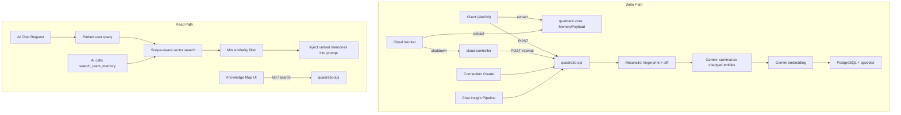
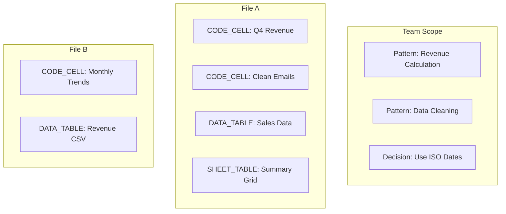

# AI Memory System

## Overview

The AI Memory System is a team-scoped knowledge store that automatically generates, stores, and retrieves summaries of files, code cells, data tables, sheet tables, connections, and chat insights. It organizes knowledge by **topic** (not by chat) and uses **scope hierarchy** (file vs team) to distinguish file-specific knowledge from team-wide patterns.

Every time a user runs code, connects to a database, or has a meaningful AI conversation, the system extracts key information, summarizes it with an LLM, and stores it as a searchable memory. When any team member later asks the AI a question, relevant memories are automatically retrieved via vector search and included in context.

## Architecture

The system has two main paths: a **write path** that creates memories, and a **read path** that retrieves them during AI conversations.



### Design Principles

- **Content extraction lives in Rust (`quadratic-core`)** so the same code works from both the browser (WASM) and cloud workers (native). No duplication of extraction logic.
- **Summarization and storage live in `quadratic-api`** (TypeScript/Node.js) where the LLM providers and database are already integrated.
- **Memories are organized by topic**, not by chat session. Multiple conversations about the same topic merge into richer knowledge.
- **Scope hierarchy** distinguishes file-specific knowledge from team-wide patterns and decisions.
- **Reconciliation-based updates**: instead of deleting and recreating memories, the system fingerprints source content and only re-summarizes entities that have changed.
- **Quality filtering** prevents trivial tool executions from polluting the knowledge base.
- **Version history**: when a memory is updated, the old summary is preserved in `metadata.previousSummaries`.

## Scope Hierarchy



| Scope | Description | Examples |
|-------|-------------|---------|
| `file` | Knowledge specific to one file | CODE_CELL summaries, FILE summaries, DATA_TABLE and SHEET_TABLE descriptions, file-specific insights |
| `team` | Patterns and decisions applicable across files | Reusable patterns, domain concepts, team decisions, connections |

### Scope Assignment Rules

| Entity Type | Default Scope | Notes |
|-------------|---------------|-------|
| FILE | file | Always describes one file |
| CODE_CELL | file | Always in one file |
| DATA_TABLE | file | Imported data tables (CSV/Excel) within a file |
| SHEET_TABLE | file | Inline tabular cell regions detected within a file |
| CONNECTION | team | Connections are team-wide resources |
| CHAT_INSIGHT | depends | LLM determines scope based on content |

## Data Flow

### Client-Triggered Memories (Primary Path)

The client triggers memory generation in response to three types of events, each with a different debounce:

- **Code cell execution** (`updateCodeCells` event): 5-second debounce
- **Immediate data transactions** (Import, DataTableAddDataTable, GridToDataTable): 5-second debounce
- **Deferred data transactions** (SetCells, PasteClipboard, CutClipboard, Autocomplete, FlattenDataTable, DataTableMutations, MoveCells, SwitchDataTableKind, DataTableFirstRowAsHeader): 15-second debounce
- **Load check**: After 2.5 seconds on file open, if the file has content but no memories (e.g., old files, imported CSV/Excel, duplicated files), generation is triggered automatically

All triggers share a 60-second per-file cooldown at the API call level to prevent excessive requests.

1. Event fires on the client (code cell update or transaction end)
2. After the event-specific debounce and the per-file cooldown, the client calls `quadraticCore.getMemoryPayload()`
3. The WASM binding calls `GridController::extract_memory_payload()` in Rust
4. The client POSTs the payload to `POST /v0/teams/:uuid/ai/memories/generate`
5. The API returns `202 Accepted` immediately
6. In the background, the API **reconciles** against existing memories:
   - Fetches existing file-scoped memories and builds a lookup by `entityType:entityId`
   - Computes content fingerprints (MD5 hashes) for each entity in the payload
   - **Skips** entities whose fingerprint matches the existing memory (no LLM call)
   - **Updates** entities whose fingerprint differs: preserves old summary in version history, re-summarizes with LLM
   - **Creates** new entities that have no existing memory
   - **Deletes** orphaned memories (entities that no longer exist in the payload)

### Content Fingerprinting

Each entity type has a deterministic fingerprint based on its source content:

- **CODE_CELL**: `md5(code + language + outputShape)`
- **DATA_TABLE**: `md5(name + sorted_columns + bounds)`
- **SHEET_TABLE**: `md5(columns + bounds + rows + cols)`
- **FILE**: `md5(sheetNames + codeCellCount + dataTableCount + sheetTableCount)`

The fingerprint is stored in `metadata.contentHash` and compared on subsequent generations.

### Cloud Worker Memories (Scheduled Tasks)

1. Cloud worker finishes executing scheduled task operations
2. During shutdown, the worker calls `self.core.extract_memory_payload()`
3. The `memory_payload` JSON is included in the `ShutdownRequest`
4. The controller forwards it to `POST /v0/internal/file/:uuid/ai-memory`
5. The API processes it identically to the client path (reconciliation)

### Connection Memories

1. User creates a database connection via `POST /v0/teams/:uuid/connections`
2. The route handler calls `generateConnectionMemory()` in the background
3. Stored as an `AiMemory` with `entityType = CONNECTION`, `scope = team`

### Chat Insight Memories

Chat insights go through a multi-stage pipeline, triggered on **every user prompt** (not on a fixed interval):

1. Every AI chat message is processed through `ai.chat.POST`
2. On every user prompt, the handler triggers the insight pipeline
3. **Quality filtering** (heuristic, no LLM cost):
   - Skip if <2 substantive messages (>50 chars, not pure tool calls)
   - Skip if >80% of messages are pure tool executions
   - Skip if no assistant message with >100 chars of explanation
4. **Topic extraction** (LLM):
   - Extract primary topic, related concepts, knowledge type, summary, and scope
   - LLM can output "SKIP" if conversation is trivial
5. **Topic similarity search**:
   - Search for existing memories with similar topics (threshold: 0.85)
   - If found, preserve old summary in version history, then merge new knowledge
   - If not found, create new topic-based memory
6. Entity ID is `topic:<hash>` (one memory per topic, merges across chats)

### Version History

When a memory is updated (either through reconciliation or chat insight merging), the old summary is preserved in `metadata.previousSummaries`:

```typescript
metadata.previousSummaries: Array<{
  summary: string;
  updatedAt: string; // ISO timestamp
}>
```

Capped at 5 entries (FIFO). This provides an audit trail and enables future undo functionality.

## Data Model

### `ai_memory` Table

| Column | Type | Description |
|--------|------|-------------|
| `id` | `SERIAL` | Primary key |
| `team_id` | `INTEGER` | Foreign key to Team (required) |
| `file_id` | `INTEGER` | Foreign key to File (nullable, null for team-scoped) |
| `entity_type` | `AiMemoryEntityType` | `FILE`, `CODE_CELL`, `DATA_TABLE`, `SHEET_TABLE`, `CONNECTION`, or `CHAT_INSIGHT` |
| `entity_id` | `TEXT` | Unique identifier (e.g., `Sheet1:A1`, `topic:<hash>`, connection UUID) |
| `scope` | `AiMemoryScope` | `file` or `team` |
| `topic` | `TEXT` | Topic label for organization and display |
| `title` | `TEXT` | Short label for display |
| `summary` | `TEXT` | Natural language summary |
| `embedding` | `vector(768)` | Gemini embedding for semantic search |
| `metadata` | `JSONB` | Structured data (contentHash, concepts, patterns, previousSummaries, etc.) |
| `pinned` | `BOOLEAN` | Whether the memory is pinned by a user |
| `version` | `INTEGER` | Incremented on each re-summarization |
| `created_at` | `TIMESTAMP` | Creation timestamp |
| `updated_at` | `TIMESTAMP` | Last update timestamp |

### `ai_memory_link` Table (unused, retained for schema compatibility)

The `ai_memory_link` table exists in the schema but is not currently read from or written to. It was originally designed for a knowledge graph but was found to be redundant with vector similarity search.

**Indexes:**
- `(team_id, entity_type)` -- for filtered listing
- `(team_id, file_id)` -- for file-scoped queries
- `(team_id, scope)` -- for scope-filtered queries
- `(team_id, topic)` -- for topic-based queries
- `(team_id, file_id, entity_type, entity_id)` -- unique constraint for upsert deduplication
- `embedding` -- IVFFlat index for cosine similarity search

## Context Retrieval

### Scope-Aware Vector Search

In `ai.chat.POST.ts`, before the LLM call:

1. Extract the text from the user's latest message
2. Call `getMemoryContext(teamId, userText, fileId)` in `context.helper.ts`
3. This calls `getMemoryContextWithNetwork()` which:
   - Searches team-scoped memories via vector similarity (limit 5)
   - Searches file-scoped memories for current file via vector similarity (limit 5)
   - Filters out memories below `MIN_SIMILARITY = 0.4`
   - Combines and ranks with scope boosts
4. Up to 10 memories are formatted as context and prepended to the conversation

### Retrieval Priority

1. **Current file memories** (1.5x boost) -- Direct context
2. **Team patterns** (1.3x boost) -- Applicable patterns and concepts

### Tool-Based Retrieval (AI-Initiated)

The `search_team_memory` tool supports filtering by `entity_type` and `scope`.

## API Endpoints

### Public Endpoints (JWT authenticated)

| Method | Path | Description |
|--------|------|-------------|
| `POST` | `/v0/teams/:uuid/ai/memories/generate` | Accept MemoryPayload, reconcile and generate summaries + embeddings |
| `POST` | `/v0/teams/:uuid/ai/memories/regenerate` | Reconcile file memories from current grid state |
| `GET` | `/v0/teams/:uuid/ai/memories` | List memories (paginated, filterable by scope/type) |
| `GET` | `/v0/teams/:uuid/ai/memories/search?q=` | Semantic search with scope filter |
| `GET` | `/v0/teams/:uuid/ai/memories/has-file/:fileUuid` | Check if a file has any memories |
| `GET` | `/v0/teams/:uuid/ai/memories/:id` | Get single memory |
| `PATCH` | `/v0/teams/:uuid/ai/memories/:id` | Edit summary, title, or pin/unpin (regenerates embedding) |
| `DELETE` | `/v0/teams/:uuid/ai/memories/:id` | Delete a memory |

### Internal Endpoint (M2M authenticated)

| Method | Path | Description |
|--------|------|-------------|
| `POST` | `/v0/internal/file/:uuid/ai-memory` | Receive forwarded payload from cloud controller |

### Query Parameters

**List endpoint** (`GET /v0/teams/:uuid/ai/memories`):
- `entityType` -- filter by entity type
- `scope` -- filter by `file` or `team`
- `fileId` -- filter by file
- `cursor`, `limit` -- pagination

**Search endpoint** (`GET /v0/teams/:uuid/ai/memories/search`):
- `q` -- search query (required)
- `entityType`, `scope`, `fileId`, `limit` -- filters

## Knowledge Map UI

The Knowledge Map is a React component (`AiMemoryMindMap`) that provides two scope-aware views:

- **File View**: Shows file-scoped memories grouped by entity type (files, code cells, data tables, sheet tables, connections, insights)
- **Team View**: Shows team-scoped memories grouped by topic

### Features

- **Scope badges**: Visual indicators for file vs team scope on each memory node
- **Detail panel**: Shows scope, topic, summary, metadata, and version history
- **Version history**: Collapsible section showing previous summaries with timestamps
- **Regenerate**: User-initiated reconciliation from current grid state (updates changed, skips unchanged, deletes orphans)
- **Edit/Pin/Delete**: Standard memory management actions

The knowledge map is opened via a jotai atom (`showAiMemoryMindMapAtom`) and rendered as a modal overlay in `QuadraticUI.tsx`.

## Maintenance

Maintenance runs automatically by piggybacking on the write path. A per-team write counter tracks upserts, and when it reaches 50, maintenance fires in the background:

1. **Prune stale memories**: Remove memories that are unpinned, version 1 (never updated), and older than 90 days
2. **Deduplicate**: Find near-duplicate memories (>0.95 embedding similarity) and delete the lower-version one
3. **Reindex**: `REINDEX INDEX CONCURRENTLY ai_memory_embedding_idx` to keep the IVFFlat vector index optimal

The counter is in-memory and resets on server restart, which is acceptable since maintenance just runs slightly less often after a deploy.

### Utility Functions

`memoryMaintenance.ts` also provides utilities for manual inspection:

- **`findStaleMemories(teamId)`**: Finds memories whose associated file has been updated more recently than the memory
- **`findRelatedFiles(teamId, fileId)`**: Uses embedding similarity to discover cross-file relationships
- **`findDuplicateMemories(teamId, threshold)`**: Detects near-duplicate memories

## Infrastructure

### PostgreSQL + pgvector

The `ai_memory` table lives in the same PostgreSQL database as all other Quadratic data. The pgvector extension is required and installed via the migration. The dev Docker image uses `pgvector/pgvector:pg17`.

### LLM Usage

| Operation | Model | Cost |
|-----------|-------|------|
| File summary | Gemini 2.0 Flash | ~$0.0003 per summary |
| Code cell analysis | Gemini 2.0 Flash | ~$0.0003 per analysis |
| Chat insight (topic + quality + merge) | Gemini 2.0 Flash | ~$0.0004 per insight |
| Embedding (per text) | Gemini embedding-001 | ~$0.00002 per embedding |
| Auto-retrieval (per chat) | Gemini embedding-001 | ~$0.00004 per query (2 scope searches) |

## File Inventory

### Rust

| File | Purpose |
|------|---------|
| `quadratic-core/src/grid/memory_payload.rs` | `MemoryPayload` struct + `extract_memory_payload()` on `GridController` |
| `quadratic-core/src/wasm_bindings/controller/ai_context.rs` | `getMemoryPayload` WASM binding |
| `quadratic-core-cloud/src/worker.rs` | `extract_memory_payload()` on cloud Worker |
| `quadratic-rust-shared/src/quadratic_cloud.rs` | `memory_payload` field on `ShutdownRequest` |
| `quadratic-rust-shared/src/quadratic_api.rs` | `forward_memory_payload()` API helper |
| `quadratic-cloud-worker/src/worker.rs` | Extracts payload during shutdown |
| `quadratic-cloud-controller/src/handle.rs` | Forwards payload to API in `shutdown_worker` |

### TypeScript (API)

| File | Purpose |
|------|---------|
| `quadratic-api/prisma/schema.prisma` | `AiMemory`, `AiMemoryLink` models + enums |
| `quadratic-api/prisma/migrations/20260214000000_add_ai_memory/` | pgvector + tables + indexes |
| `quadratic-api/src/ai/memory/memoryService.ts` | Core service: reconciliation, summarize, embed, upsert, search, quality filter, topic extraction, knowledge merge, content fingerprinting, maintenance counter |
| `quadratic-api/src/ai/memory/memoryRetrieval.ts` | Scope-aware vector search with minimum similarity threshold |
| `quadratic-api/src/ai/memory/memoryMaintenance.ts` | Staleness, deduplication, pruning, reindexing, orchestrated maintenance |
| `quadratic-api/src/ai/helpers/context.helper.ts` | `getMemoryContext()` for scope-aware auto-retrieval |
| `quadratic-api/src/routes/v0/teams.$uuid.ai.memories.generate.POST.ts` | Accept payload and reconcile memories in background |
| `quadratic-api/src/routes/v0/teams.$uuid.ai.memories.regenerate.POST.ts` | User-initiated reconciliation from current grid state |
| `quadratic-api/src/routes/v0/teams.$uuid.ai.memories.GET.ts` | List memories (paginated, filterable) |
| `quadratic-api/src/routes/v0/teams.$uuid.ai.memories.search.GET.ts` | Semantic search |
| `quadratic-api/src/routes/v0/teams.$uuid.ai.memories.has-file.$fileUuid.GET.ts` | Check if file has memories |
| `quadratic-api/src/routes/v0/teams.$uuid.ai.memories.$id.GET.ts` | Get single memory |
| `quadratic-api/src/routes/v0/teams.$uuid.ai.memories.$id.PATCH.ts` | Update memory (title, summary, pin) |
| `quadratic-api/src/routes/v0/teams.$uuid.ai.memories.$id.DELETE.ts` | Delete memory |
| `quadratic-api/src/routes/internal/file.$fileUuid.ai-memory.POST.ts` | Internal endpoint for cloud worker |
| `quadratic-api/src/routes/v0/ai.chat.POST.ts` | Memory context injection + chat insight trigger on every user prompt |
| `quadratic-api/src/routes/v0/files.$uuid.PATCH.ts` | Updates FILE memory title when file is renamed |
| `quadratic-api/src/routes/v0/teams.$uuid.connections.POST.ts` | Connection memory on create |

### TypeScript (Client)

| File | Purpose |
|------|---------|
| `quadratic-client/src/app/ai/memory/aiMemoryService.ts` | Client API service for memory CRUD and generation |
| `quadratic-client/src/app/ai/memory/useAiMemoryTrigger.ts` | React hook for auto-triggering on code execution |
| `quadratic-client/src/app/atoms/aiMemoryAtom.ts` | Jotai atom for knowledge map visibility |
| `quadratic-client/src/app/ui/menus/AiMemory/AiMemoryMindMap.tsx` | Knowledge map with scope views |
| `quadratic-client/src/app/ui/menus/AiMemory/AiMemoryNodeDetail.tsx` | Detail panel with scope, topic, version history |
| `quadratic-client/src/app/ui/QuadraticUI.tsx` | Mounts trigger hook + knowledge map |

### TypeScript (Shared)

| File | Purpose |
|------|---------|
| `quadratic-shared/ai/specs/aiToolsCore.ts` | `SearchTeamMemory` enum value |
| `quadratic-shared/ai/specs/schemas/miscSchemas.ts` | Schema + spec for `search_team_memory` tool |
| `quadratic-client/src/app/ai/tools/aiMiscActions.ts` | Tool execution handler |
| `quadratic-client/src/app/web-workers/quadraticCore/coreClientMessages.ts` | `MemoryPayload` TS types + message interfaces |
| `quadratic-client/src/app/web-workers/quadraticCore/worker/core.ts` | `getMemoryPayload()` bridge |
| `quadratic-client/src/app/web-workers/quadraticCore/worker/coreClient.ts` | Message handler |
| `quadratic-client/src/app/web-workers/quadraticCore/quadraticCore.ts` | `getMemoryPayload()` public API |

### Infrastructure

| File | Purpose |
|------|---------|
| `docker-compose.yml` | PostgreSQL image changed to `pgvector/pgvector:pg17` |
