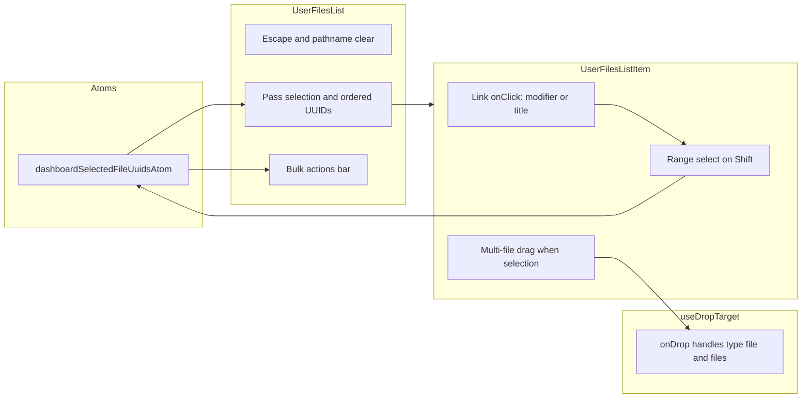

# Dashboard multi-select for files (updated)

## Current behavior

- **UserFilesListItem.tsx**: The whole card is a single `<Link>` to the file. Clicks anywhere navigate.
- **FilesListItems.tsx**: Grid layout has thumbnail (aspect-video) on top, then separator, then `
{children}
` for the title/metadata (name, description, creator, actions).
- **FilesListItemCore.tsx**: Renders the title (h2), description, optional creator avatar (button with `stopPropagation`), and the "…" dropdown. Only the creator button currently stops propagation; the dropdown trigger does not.

## Target behavior

| Interaction | Result |
|-------------|--------|
| Click on **thumbnail** (no modifier) | Open file (navigate) |
| Click on **thumbnail** with Shift or Cmd/Ctrl | Select file (no navigation) |
| **Shift+click** on thumbnail or title | Range select from last-selected index to current index |
| Click on **title area** (bottom part) | Select file (no navigation) |
| Click on buttons in title (avatar, "…" menu) | Existing behavior; no select, no navigate |
| When at least one file is selected ("selection mode") | Title area uses `cursor: pointer`; bulk actions bar visible |
| **Drag** one or more selected files | Show pile-of-cards drag image; drop into any folder/subfolder moves all (same as single-file move) |

No existing selection state exists; this will be new.

---

## 1. Selection state and range select

- Add **dashboardSelectedFileUuidsAtom** (Jotai): store **Set\<string\>** (or ordered list for range) of selected file UUIDs.
- **Range select**: Keep an ordered list of file UUIDs (the current `filesToRender` order in UserFilesList). When Shift+clicking:
  - If there is a "last selected index", select from min(lastIndex, currentIndex) to max(lastIndex, currentIndex) in that order.
  - If no previous selection, treat like a normal select (add only the clicked item). Store "last selected index" or "last selected UUID" so the next Shift+click has a range anchor.
- Clear selection on Escape, pathname change, and optionally click on list background.

---

## 2. UserFilesList and bulk actions bar

- **UserFilesList**: Owns selection (atom), clears on route/Escape, passes `selectedFileUuids`, `onToggleSelection`, `onRangeSelect`, `isSelectionMode`, and **ordered list of file UUIDs** (for range) to items.
- **Bulk actions bar**: When `selectedFileUuids.size > 0`, show a bar (e.g. above or below the list) with:
  - "N selected" and a clear-selection control.
  - **Move to folder**: reuse [MoveToFolderDialog](quadratic-client/src/dashboard/components/MoveToFolderDialog.tsx) pattern but for multiple files (API: call `apiClient.files.update(uuid, { folderUuid })` for each).
  - **Delete**: reuse existing delete action (e.g. [getActionFileDelete](quadratic-client/src/routes/api.files.$uuid.ts)) per file, or add a bulk-delete API if one exists; otherwise loop single-file delete.
  - **Download**: if applicable, trigger download for each or a zip (product decision).
  Other actions (Duplicate, Share) can be added similarly using existing per-file APIs in a loop.

---

## 3. UserFilesListItem: Link, modifiers, and title area

- **Link onClick**: If `e.metaKey || e.ctrlKey`: preventDefault, toggle this file in selection, set "last selected index" to this item. If `e.shiftKey`: preventDefault, run range-select from last-selected index to this index. If click target is inside `[data-file-title-area]`: preventDefault, same modifier rules (toggle or range-select).
- Add **stopPropagation** on the "…" dropdown trigger so opening the menu doesn’t trigger Link or select.
- Pass `isSelected` and `isSelectionMode` into ListItemView for styling and cursor.
- **ListItemView / FilesListItemCore**: Title area gets `data-file-title-area`, `cursor: pointer` when `isSelectionMode`; selected state styling (ring/border).

---

## 4. Multi-file drag: pile of cards and drop

- **Drag payload**: Extend [useFolderDragDrop](quadratic-client/src/dashboard/hooks/useFolderDragDrop.ts) to support multiple files:
  - Option A: Add a second payload shape, e.g. `{ type: 'files', uuids: string[], ownerUserId: number | null }`. Drop handler checks `type === 'files'` and loops.
  - Option B: Keep single `type: 'file'` but when dragging from selection, set a custom application/json that includes `uuids: string[]` and a single `ownerUserId` (all selected files must be same owner for simplicity, or document that mixed-owner selection uses first file’s owner).
- **When to use multi-drag**: If the user starts a drag on a card that is in the current selection and the selection has more than one file, use multi-file payload and pile-of-cards image. Otherwise use existing single-file drag (current `getDragProps`).
- **Pile-of-cards drag image**: In [useFolderDragDrop.ts](quadratic-client/src/dashboard/hooks/useFolderDragDrop.ts), add a function (e.g. `setPileOfCardsDragImage`) that:
  - Draws 2–3 stacked card outlines (or 2–3 small thumbnails if available) with slight horizontal/vertical offset to suggest a stack. Can use canvas: draw rounded rects with shadow/offset, or composite up to 3 thumbnails from the DOM (first 3 selected items). Fallback to 2–3 icon-based cards if thumbnails aren’t ready.
  - Called from a new `getMultiFileDragProps({ uuids, ownerUserId })` (or from `getDragProps` when passed `uuids.length > 1`). The element that receives drag props must still be the wrapper div (not the Link), and when starting a multi-file drag, set `e.dataTransfer.setData('application/json', JSON.stringify({ type: 'files', uuids, ownerUserId }))`.
- **Drop targets**: Update [useDropTarget](quadratic-client/src/dashboard/hooks/useFolderDragDrop.ts) `onDrop`:
  - After parsing JSON, if `data.type === 'files'` and `data.uuids` is an array, loop over `data.uuids` and for each call the same move logic as single file: `apiClient.files.update(uuid, { folderUuid: targetFolderUuid })` (and if `needsOwnershipChange` for root + ownership, use the same pattern per file). Then `revalidator.revalidate()` once. On error, show one snackbar and optionally revert or leave partial state.
- **Drop target surface**: No change needed—existing folder tree nodes and folder list items already use `useDropTarget(node.uuid, targetOwnerUserId)` or `useDropTarget(folder.uuid, effectiveOwnerUserId)`; they will accept the new payload once onDrop handles `type === 'files'`. Root/section targets (e.g. DashboardSidebar’s useOwnershipDropTarget) also stay the same; just extend the same onDrop logic for `type === 'files'` (move each to root + ownership if needed).

---

## 5. Files to add

- `quadratic-client/src/dashboard/atoms/dashboardSelectedFileUuidsAtom.ts` – selection state (Set or array + "last selected index" for range).
- Optional: small component for **bulk actions bar** (e.g. `DashboardBulkFileActionsBar.tsx`) that receives `selectedUuids`, clear callback, and handlers for Move / Delete / etc.

## 6. Files to modify

- **UserFilesList.tsx**: Selection state, ordered file UUIDs, clear on route/Escape, range-select handler, pass props to items; render bulk actions bar when selection non-empty.
- **UserFilesListItem.tsx**: Link onClick (modifier + title-area), range-select on Shift, stopPropagation on dropdown trigger; when starting drag, if this file is in selection and selection has multiple files, use multi-file drag props and pile image; otherwise use existing getDragProps. Pass `isSelected` / `isSelectionMode` to ListItemView.
- **FilesListItems.tsx**: ListItemView accepts `isSelected`, `isSelectionMode`; selected styling; title area cursor.
- **FilesListItemCore.tsx**: `data-file-title-area` on title/description wrapper; cursor when `isSelectionMode`.
- **useFolderDragDrop.ts**: Extend `DragPayload` (or add union type) with `type: 'files', uuids: string[], ownerUserId`; add `setPileOfCardsDragImage` and `getMultiFileDragProps` (or extend `getDragProps` to accept optional `uuids[]`); in `useDropTarget`’s onDrop, handle `type === 'files'` by looping `apiClient.files.update` for each UUID.

## 7. Data flow (high level)

## 8. Testing

- Manual: modifier+click and title-area click select; Shift+click range select; Escape and route clear selection; bulk bar appears and Move/Delete work; dragging one card uses single drag image; dragging when multiple selected uses pile-of-cards and drop into folder moves all; dropdown and avatar still work.
